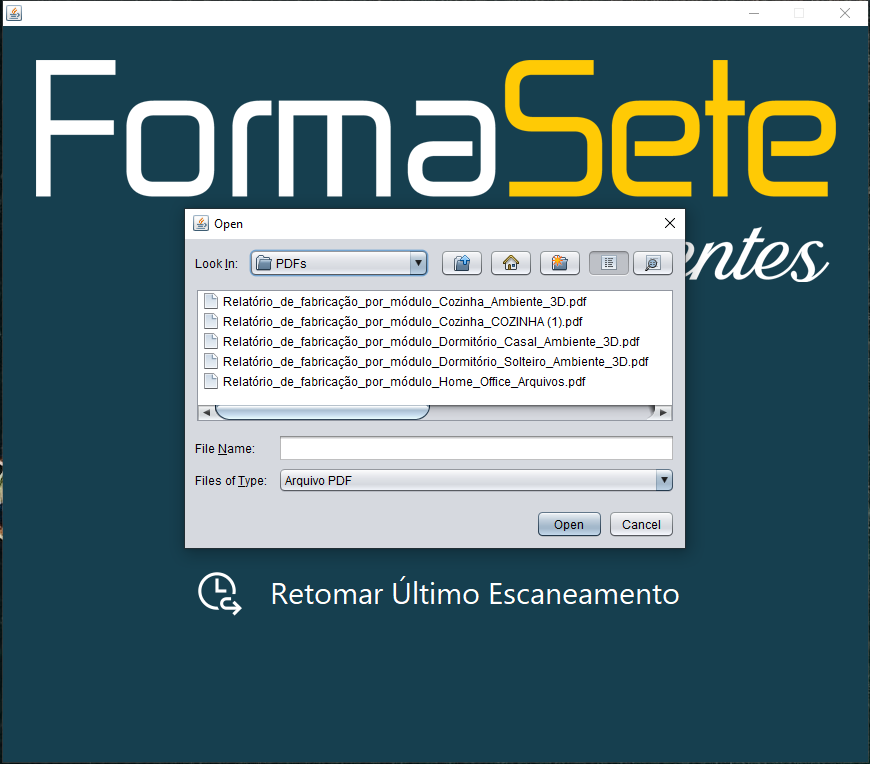
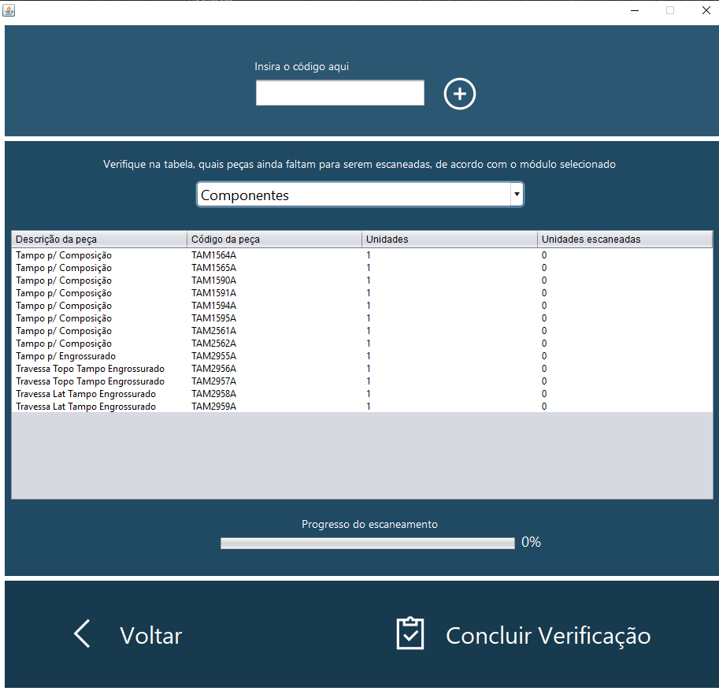
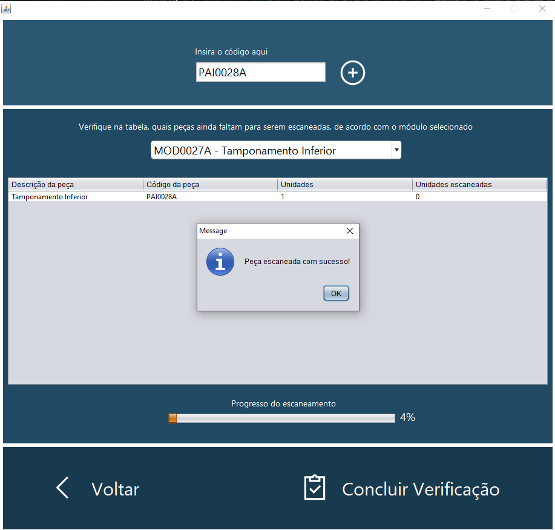
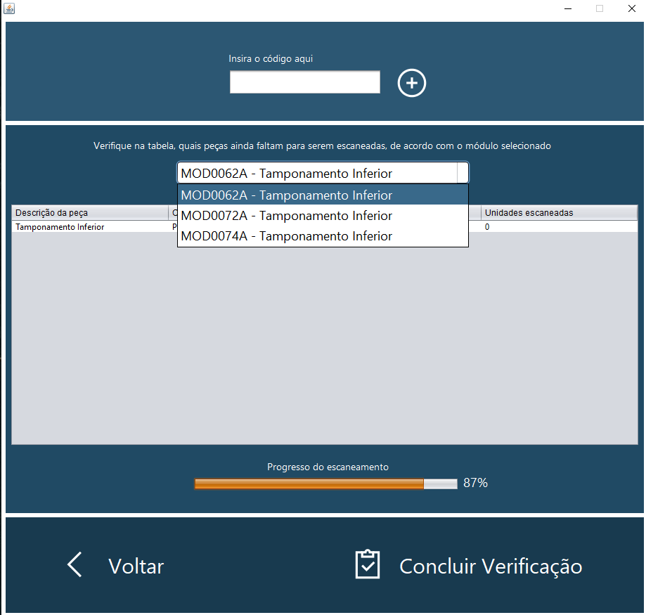
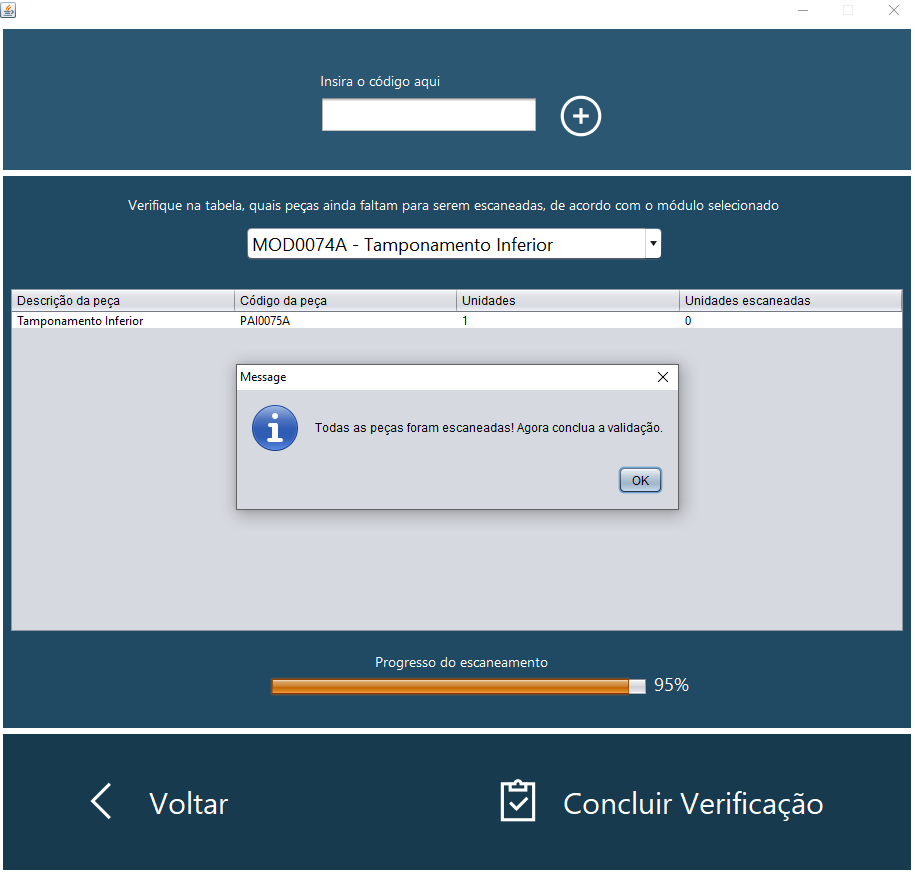
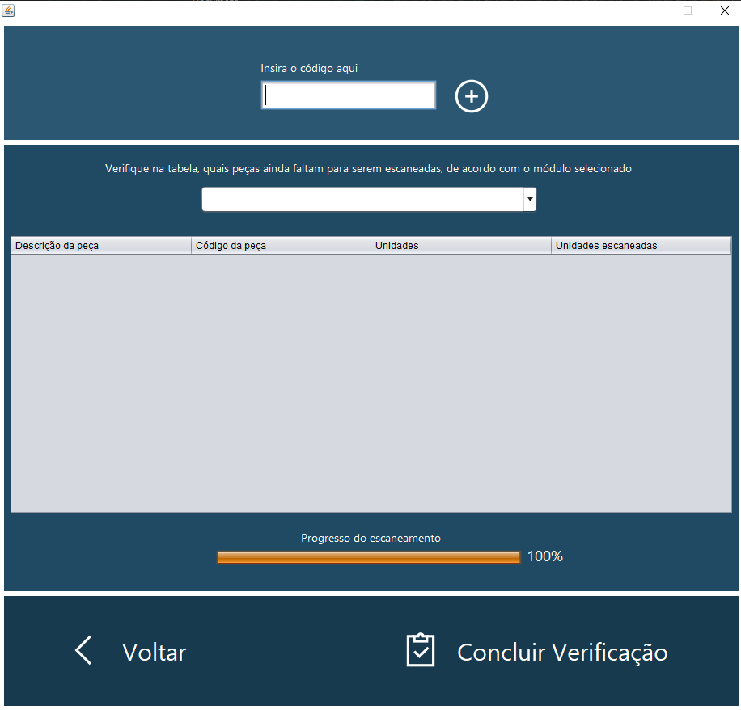

<h1 align="center">✅ Furniture's Parts Checker ✅</h1>

<h1 align="center">
 
</h1>

<h3 align="center">⚠️ IMPORTANT! ⚠️</h3>

Only **Promob** users would be able to use it, this project only works with the *manufactoring report* of Promob, but it can be improved for a new environment of data.

## Summary
* [About](#ℹ%EF%B8%8F-about)
* [Screenshots](#%EF%B8%8F-screenshots)
* [Features](#-features)
* [Technologies](#%EF%B8%8F-technologies-involved)
* [Platforms](#%EF%B8%8F-platforms)
* [Database Management](#-database-management)
* [Requirements to Run](#%EF%B8%8F-requirements-to-run)

### ℹ️ About
This is a starter project to get experience in the developping world, but I would like to make this project useful for possible clients. I made this project for a custom-made furniture enterprise (Forma Sete), and it solves their problem of getting missing parts when they go to the client's property to build the furniture. In resume, this software checks the integrity of the furniture and if all the parts are ready to dispatch to the build process in client's property.

### 🖼️ Screenshots

 
 
 
 
 
 
 
 

### 🥏 Features
 * You guarantee that the furniture will leave from factory with no parts missing into the client's property
 * There are some apps that works as a scanner, it could be useful in this case
   * [Andro Code Scanner](https://play.google.com/store/apps/details?id=az.android.remoteinput&hl=pt)
     * This app requires the installation of this one too, [Barcode Scanner](https://play.google.com/store/apps/details?id=com.google.zxing.client.android&hl=pt_BR)
   * You can operate it remotely
 * As long as you scan, the parts scanned are removed from the table, displaying only what is left to verify, making it easier for the operator
  
### ⚙️ Technologies involved
* [Java](https://www.java.com/pt_BR/) ☕
* [MySQL](https://www.mysql.com/) 🐬

### 💾 Database management
* [MySQL](https://www.mysql.com/) 🐬

### 🖥️ Platforms
* PC only 🖥️

### ☑️ Requirements to Run
* [Java Runtime Environment](https://www.java.com/pt_BR/download/)
* [MySQL](https://dev.mysql.com/downloads/)
